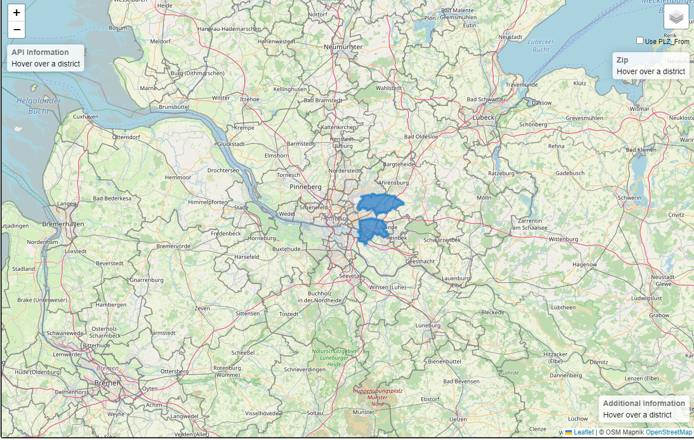

# CloudComputing

Project developed as part of the Module _Cloud Computing_, offered by [HAW](https://www.haw-hamburg.de/en/). 

The project consists of a [leaf-let](https://leafletjs.com/) application (Interactive map Library) that retrieves information from multiple MySQL databases. A load balancer is used for distributing requests to differents APIs. Docker is used on all services separatedly.

# Instructions

Create a bridge with `sudo docker network create leaflet_bridge`.

To run LeafLet, first acess it's folder 
`cd docker-leaflet` and build the docker image `sudo docker build -t leaflet`. Then run the newly created image with 
`sudo docker run --rm -p $PORTLEAFLET:3333 --network leaflet_bridge --name leaflet leaflet` where PORTLEAFLET refers to the adress you'll be using to load the Map (_localhost_:PORTLEAFLET). 

Next let's set the MySQL instance. First acess `cd docker-mysql` and edit the `docker-compose.yml` file with the desired connection credentials. Finnaly run `docker compose up`. Populate the DB as needed. 

Next lets set the Shipments API (for MySQL) for communicating with the DB. Go to `cd docker-shipmentsapi_mysql` and edit the file located at `app/api/databaseConfig.js` with the appropriate login credentials (According the MySQL DB). Next do `sudo docker build -t shipmentsapi_mysql .` to create the image, and then `docker run --restart on-failure -p $APIPORT:3000 -d --network leaflet_bridge --name shipmentsapi_mysql shipmentsapi_mysql`.

To handle multiple connections from LeafLet, let's configure a Load Balancer. Go to `cd docker-loadbalancer` and execute `sudo docker build -t loadbalancer .` followed by  `docker run --rm -p $LOADBALANCERPORT:8080 -e 'SERVERS=localhost:$APIPORT' -e 'LB_STRATEGY=LEAST' --name loadbalancer loadbalancer`.

We can now create multiple instances of MySQL/ShipmentsAPI and simply provide it's adress and port to the Load Balancer, separated by simple space. 

# Example

